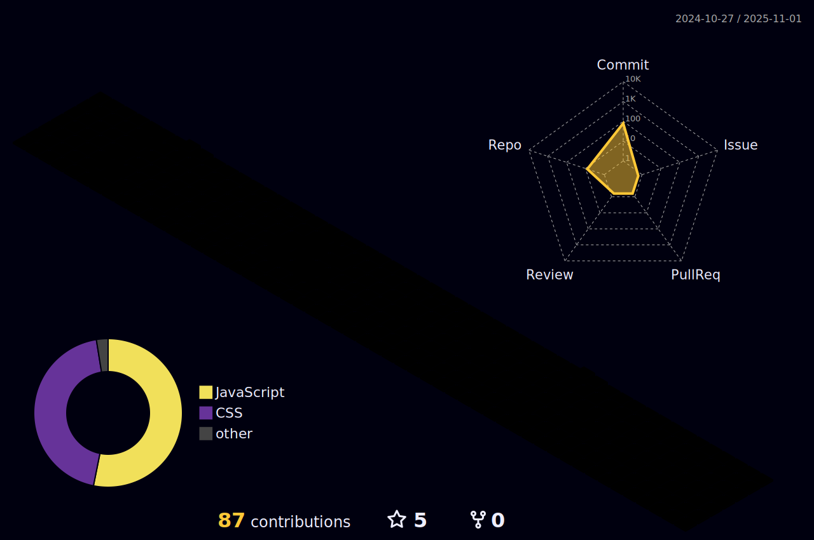

```ts
import Desenvolvedor from 'rflsza13';

class sobreMim extends Desenvolvedor {
  name = 'Rafael Souza';
  age = '31';
  degree = 'Análise e Desenvolvimento de Sistemas'
  city = 'Capivari-SP';

}
```


 | [](https://github.com/vn7n24fzkq/github-profile-summary-cards) | [](https://github.com/vn7n24fzkq/github-profile-summary-cards) |  
 | ----------- | ----------- |


 
<div align="center" >
  
  
  <br />
</div>
